 

---

### `$ whoami`

I work in cybersecurity, across the offensive and defensive sides, and I spend a fair bit of time around identity and access management. I also build full-stack web things when a project calls for it. Mostly I'm just trying to keep learning.

---

### What I Work On

Offensive security and vulnerability discovery, digital forensics and malware analysis, risk and compliance work (ISO/IEC 27005, GDPR, PCI-DSS), identity and access management, and full-stack engineering with secure backends.

---

### Tools I Use

**Security · Identity · Cloud**

**Engineering · Data**

---

### Commits

  

---

<a href="https://danielpd.com">danielpd.com</a>

